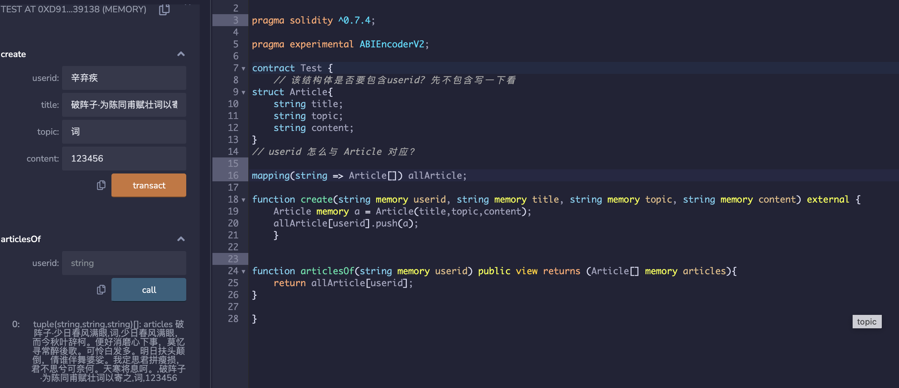
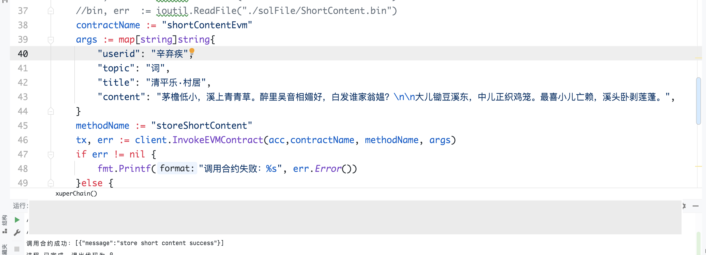
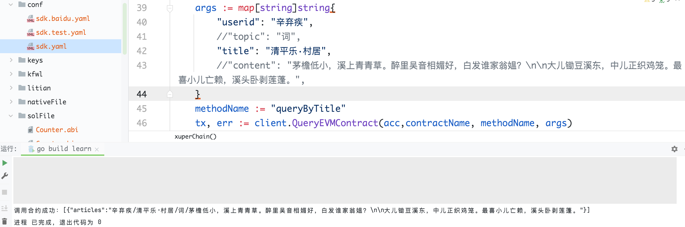

### Short_content 合约设计

#### 查询逻辑

- 根据 userid 查询，结果为一个集合。集合内容为完整的存证信息：标题、类别、内容。
- 根据 userid + title 查询，结果为一个字符串。内容为一个完整的存证信息：标题、类别、内容。标题 = title。
- 根据 userid + topic 查询，结果为一个集合。内容为完整的存证信息：标题、类别、内容。区别在于所有类别 = topic。

#### 怎么设计

**userid**

userid 需要对应一个集合。对应哪个集合？

Mapping(userid => ?[]) useridToContent


**topic**

topic 也需要对应一个集合，但是索引键为 userid + topic， 怎么设计？

Mapping(userid+topic => ?[]) topics


**title**

title 不需要集合，但是表现形式应该为： userid + title = content 的所有内容。

Mapping(userid + title => ?) Article


引入一个结构体能解决这个问题吗？

```solidity
// 该结构体是否要包含userid? 先不包含写一下看
struct Article{
	string title;
	string topic;
	string content;
}
// userid 怎么与 Article 对应？

mapping(string => Article[]) allArticle ?

// 那么create 怎么操作？
function create(string userid, string title, string topic, string content){
	Article a = Article{
		title: title,
		topic: topic,
		content: conten
	};
	allArtcile[userid].push(a);
	// 这样看起来没问题， userid 到 article 的映射可以解决，但是怎么查询呢？ return allArtcile[userid] ? 这样返回的是结构体数组，甚至不是stirng 数组， evm 支持吗？
	// todo: 确认evm 是否支持 struct[] 返回，以及 xchain 是否支持。
}


```

Evm 是支持这样写的，但注意要添加 **pragma experimental ABIEncoderV2;**




那么此合约遇到的问题便迎刃而解，但是需要做循环匹配topic title 这些，总的来说，这个合约不是非常合理

<font color="red">为了更合理的设计合约，决定用多个 mapping 来进行匹配</font>

#### 合约实现

```solidity
// SPDX-License-Identifier: GPL-3.0

pragma solidity ^0.7.4;

pragma experimental ABIEncoderV2;

contract ShortContent{
		// userid 对应一个集合， userid => title+topic+content
	mapping(string => string[]) userArticles;
	// userid + topic 对应一个集合 userid + topic => title + topic + content
	mapping(string => string[]) utopicArticles;
	// userid + title 对应一篇文章 userid + title => title + topic + content
	mapping(string => string) utitleArticles;
	// 长度限制
	uint256 maxTopicLen;
	uint256 maxTitleLen;
	uint256 maxContentLen;
	constructor(){
    maxTopicLen = 36;
    maxTitleLen = 100;
    maxContentLen = 3000;
  }
  
  function storeShortContent(string memory userid, string memory title, string memory topic, string memory content) external returns (string memory message) {
  	// 长度检验
  	require(bytes(title).length < maxTitleLen, "this title is too long");
  	require(bytes(topic).length < maxTopicLen, "this topic is too long");
  	require(bytes(content).length < maxContentLen, "this content is too long");
  	// 添加映射
  	string memory result = string(abi.encodePacked(userid,"/",title,"/",topic,"/",content));
  	string memory utopic = string(abi.encodePacked(userid,topic));
  	string memory utitle = string(abi.encodePacked(userid,title));
  	userArticles[userid].push(result);
  	utopicArticles[utopic].push(result);
  	utitleArticles[utitle] = result;
  	return "store short content success";
  }
  
  function queryByUser(string memory userid) public view returns(string[] memory articles){
  	return userArticles[userid];
  }
  
  function queryByTopic(string memory userid, string memory topic) public view returns(string[] memory articles){
  	string memory utopic = string(abi.encodePacked(userid,topic));
  	return utopicArticles[utopic];
  }
  
  function queryByTitle(string memory userid, string memory title) public view returns(string memory articles){
  	string memory utitle = string(abi.encodePacked(userid,title));
  	return utitleArticles[utitle];
  }
}
```

#### xchain测试

> 编译合约

**`solcjs --abi --bin ./short_content.sol -o build`**

> 测试存储



> 测试查询


